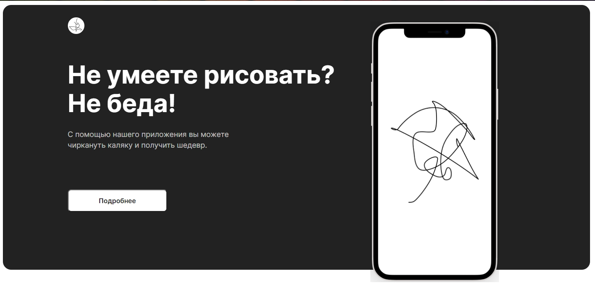

# Painting-project

----
## О проекте
Учебный проект в [Яндекс.Практикуме](https://praktikum.yandex.ru).

Реализация сайта:
1. Верстка сайта с использованием препроцессора Sass;
2. Адаптивная верстка главной страницы сайта с применением инструментов Grid Layout и Flexbox;

## Демо

[Ссылка на проект](https://janemikh.github.io/painting-project/)

